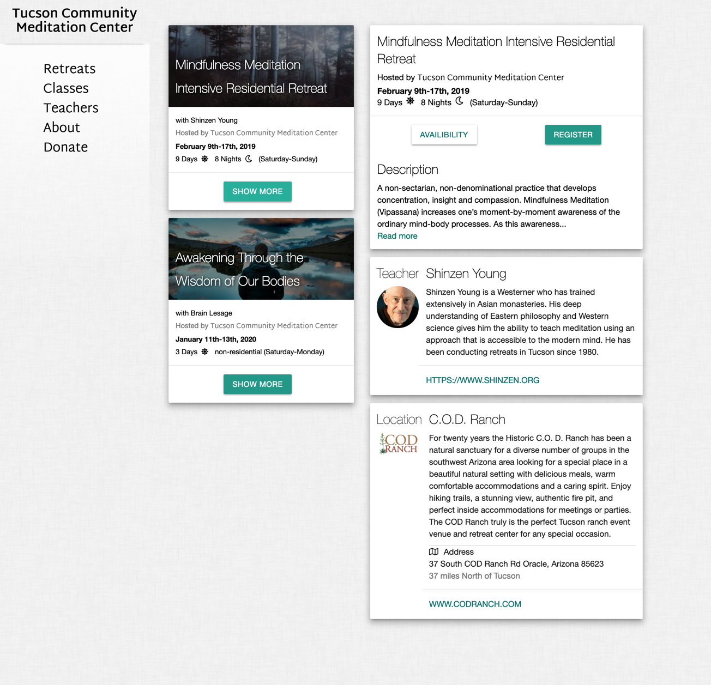
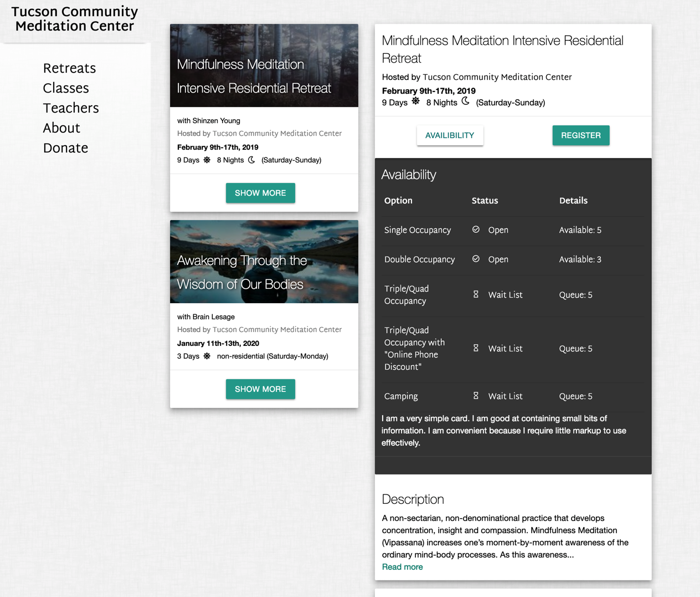
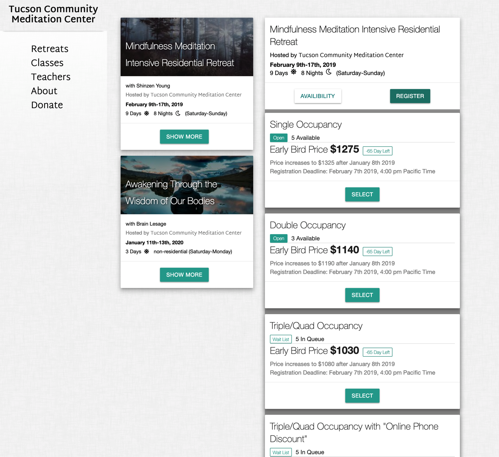

# Tucson Meditation

### An early stage React and Redux project to make registering for a Mediation Retreat easy and frictionless

# Developer Notes

- Users can sign up for a class/retreat
- Users can pay for the class.
- Users automatically receive confirmation emails (sign-up and payment)

* Admin can create a new class/retreat. Upload description and pictures. A sort of Class/Retreat CMS.
* Admin can send out update emails to everyone signed up
* Admin can view the status of the class (how many signed up, etc)

- Clearly display a compelling story of the class and teacher(s)
- One-time class or recurring class
- Times and dates of class for calendar usage
- Sign up options are listed
  - single, double room etc
  - choose volunteer job

I will need to be able to whitelist a user(s) in order for them to be a Admin.
I can send a special URL to the Admin (via email)

### Static Site Generators or CMS

Why use this?

Examples include Hugo, Wordpress, Jekyll. More at https://stackshare.io/static-site-generators

Use SPA with WordPress API https://developer.wordpress.org/rest-api/
I.e., create SPA on top of WP.

# Content

### The admin can upload new offerings
